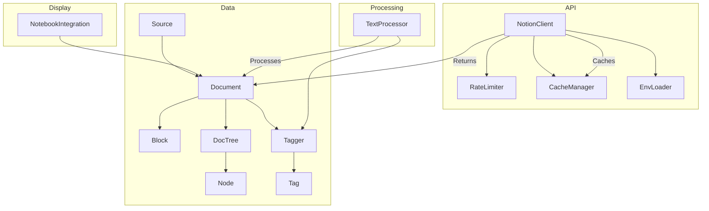
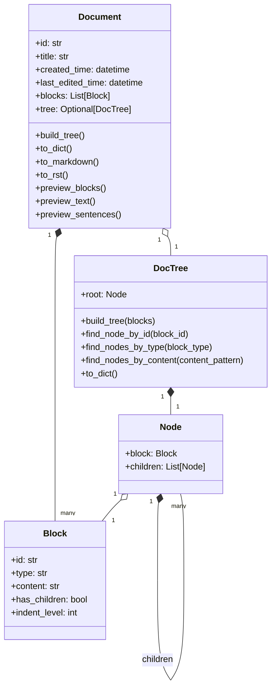
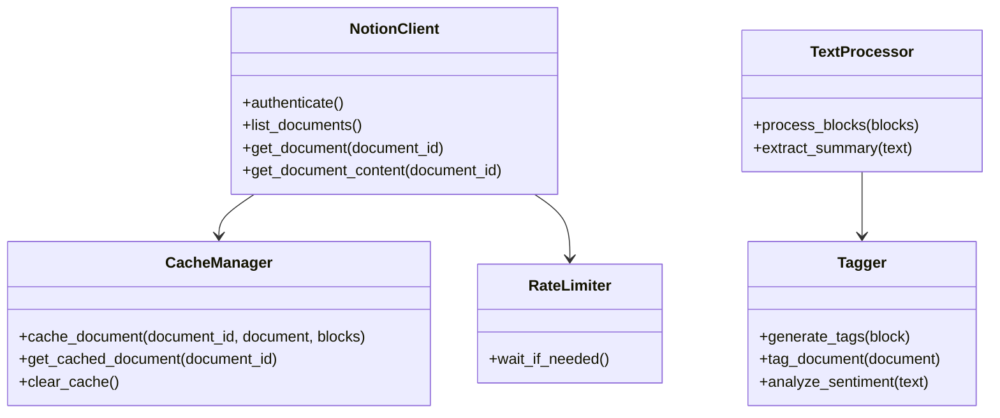
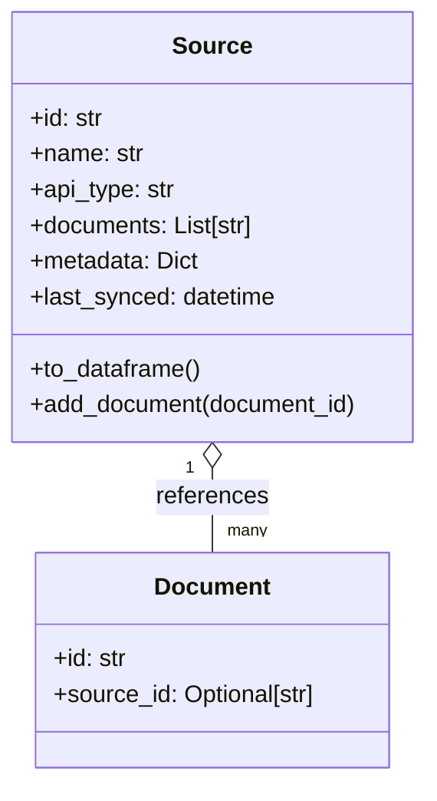
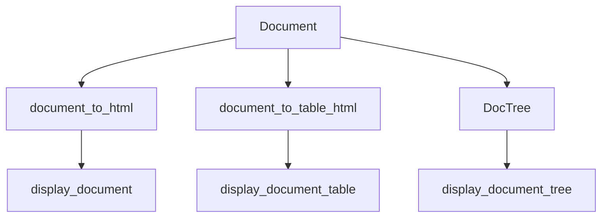
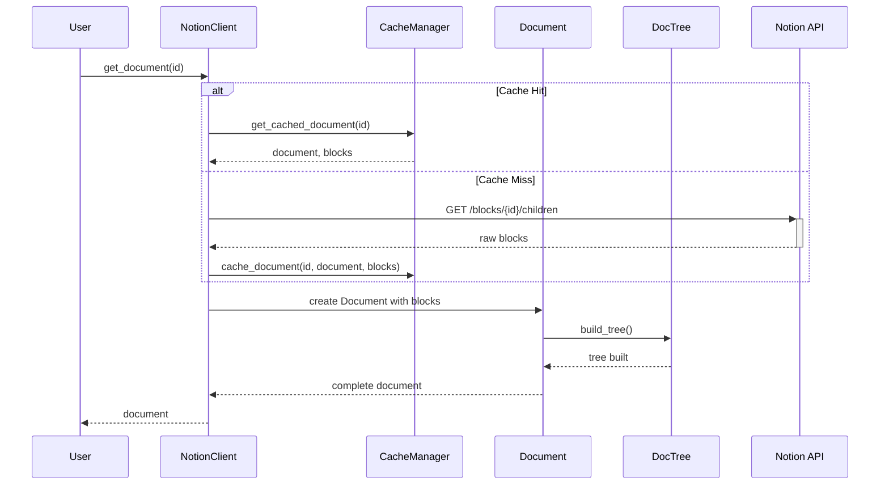

# DocTree NLP Toolkit Architecture

## Core Components

The DocTree NLP Toolkit is designed with a modular architecture, with several key components:

## Class Relationships

### Document Core

### API and Processing

### Source Management

## Notebook Integration

## Processing Flow

This architecture provides a clean separation of concerns:

1. **API Layer**: Handles communication with Notion API, rate limiting, and caching
2. **Data Layer**: Represents documents, blocks, and tree structures 
3. **Processing Layer**: Provides text analysis and processing capabilities
4. **Display Layer**: Provides integration with Jupyter notebooks for visualization

The modular design allows future expansion to support:
- Additional data sources beyond Notion
- Enhanced text processing functionality 
- More visualization options